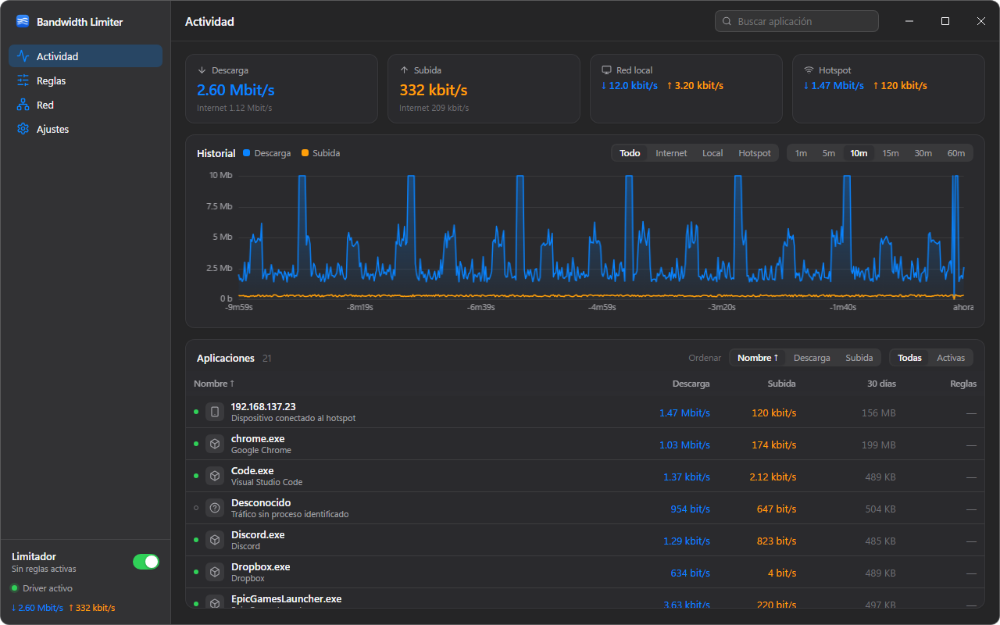
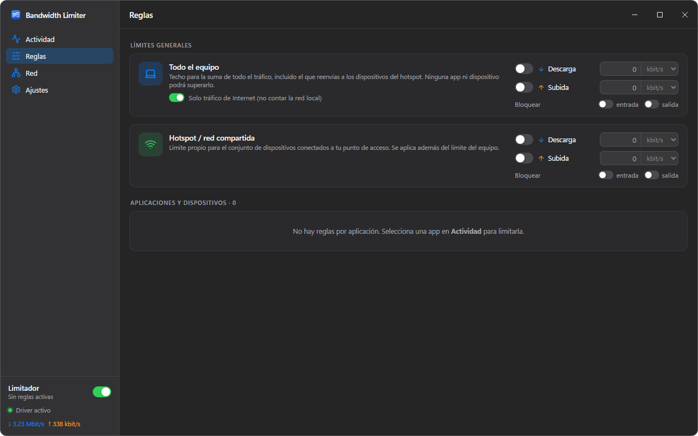

# Bandwidth Limiter

[English](README.md) · **Español**

[](https://github.com/reffer-191/bandwidth-limiter/actions/workflows/ci.yml) [](https://github.com/reffer-191/bandwidth-limiter/releases/latest)

Limitador de ancho de banda y monitor de tráfico para Windows, ligero y al estilo de NetLimiter, con una interfaz limpia inspirada en macOS. Mira qué programas están usando tu conexión ahora mismo, limita la velocidad de bajada/subida de cualquiera de ellos, pon un techo a todo el equipo y mantén bajo ese mismo límite a los dispositivos conectados a tu hotspot.



## Funciones

- **Tráfico en vivo por aplicación**: velocidad de descarga y subida de cada proceso, con su icono y descripción, y de los dispositivos conectados a tu punto de acceso móvil de Windows.
- **Límites**: por aplicación (descarga y/o subida), para todo el equipo (opcionalmente solo el tráfico de Internet, sin contar la red local) y para el hotspot. El tráfico del hotspot también cuenta contra el límite global, así que los dispositivos conectados nunca pueden superarlo.
- **Bloqueo**: corta el tráfico de entrada y/o salida de una aplicación con un interruptor.
- **Gráfica de historial (1–60 min)**: pasa el ratón para ver quién usaba la red en cada momento; haz clic en un punto para congelar la tabla en ese instante y analizar un pico; usa la rueda para ampliar hasta un segundo concreto (Shift+rueda desplaza, doble clic restablece).
- **Lista de aplicaciones estable**: ordenada por nombre o por consumo acumulado de 30 días, nunca por la velocidad instantánea, para que las filas no bailen mientras haces clic. Las aplicaciones que han usado la red en los últimos 30 días siguen en la lista aunque estén cerradas.
- **Conexiones y red**: conexiones activas por aplicación, adaptadores de red, detección del hotspot.
- **Bandeja del sistema**: minimizar/cerrar a la bandeja, activar o pausar el limitador desde su menú, velocidades en el tooltip.
- **Iniciar con Windows**, arranque minimizado, tema claro/oscuro, bits o bytes, interfaz en **español e inglés** (sigue el idioma de Windows).
- **Cómoda con el teclado**: Ctrl+F busca, Ctrl+1…4 cambia de vista, ↑/↓ + Enter en la lista, Esc cierra.
- **Actualizaciones automáticas**: las nuevas versiones se ofrecen dentro de la app y se instalan con un clic (fuente de actualizaciones firmada).
- Consumo mínimo: ~45 MB de RAM y muy por debajo del 1 % de CPU mientras limita.

## Descarga

| | Instalador | Instalador offline | Portable |
|---|---|---|---|
| Fichero | `Bandwidth.Limiter_<versión>_x64-setup.exe` (~5 MB) | `Bandwidth.Limiter_<versión>_x64_offline-setup.exe` (~210 MB) | `BandwidthLimiter-<versión>-portable.zip` (~4 MB) |
| Runtime WebView2 | Se descarga solo si el PC no lo tiene (Windows 11 lo incluye) | Embebido: funciona sin ninguna conexión | Debe estar ya instalado |
| Dónde se instala | `C:\Program Files\Bandwidth Limiter` (todos los usuarios) | igual | En la carpeta que quieras; no instala nada |
| Actualizaciones | Desde la app | Desde la app | Descargar el nuevo zip |
| Desinstalar | *Configuración → Aplicaciones*: elimina también la tarea de "iniciar con Windows" y descarga el driver | igual | Borra la carpeta |

Descarga cualquiera de los dos desde la página de [Releases](../../releases).

**Requisitos:** Windows 10/11 de 64 bits. La app pide permisos de administrador cada vez que arranca (el driver de captura lo exige); verás el aviso habitual de UAC.

> **SmartScreen y antivirus.** El ejecutable y los instaladores van firmados, pero con un certificado emitido por el propio proyecto (uno de una autoridad pública no es gratuito). Por eso Windows puede mostrar *"Windows protegió su PC"* la primera vez: pulsa **Más información → Ejecutar de todas formas**. Puedes comprobar la firma en *Propiedades → Firmas digitales* del fichero (firmante "Bandwidth Limiter, reffer-191"). La app incluye además `WinDivert.dll` y `WinDivert64.sys`, el driver de captura de paquetes de código abierto (LGPL) que usan muchas herramientas de red; son copias sin modificar de la versión oficial [WinDivert 2.2.2](https://github.com/basil00/WinDivert/releases) y conservan la firma de Microsoft del driver.

## Cómo se usa

### Actividad
Las velocidades se actualizan cada segundo. Las cuatro tarjetas muestran descarga/subida totales, tráfico de la red local y del hotspot. La lista de aplicaciones es estable: ordena por **Nombre**, **Descarga** o **Subida** (acumulado de los últimos 30 días); vuelve a pulsar la misma cabecera para invertir el orden. **Activas** oculta las aplicaciones sin tráfico; el buscador filtra por nombre, descripción o ruta.

Haz clic en una aplicación para abrir su panel de detalle: velocidad actual, totales de 30 días, PID, ruta, conexiones activas y el **editor de reglas**.

### Reglas
- En el panel de detalle, activa **Descarga** y/o **Subida**, escribe un valor y elige la unidad (kbit/s, Mbit/s o KB/s, MB/s según *Ajustes → Unidades*). La regla se aplica al instante y se conserva tras reiniciar: va ligada a la ruta del ejecutable, no al PID, así que sigue funcionando cuando vuelves a abrir el programa.
- **Bloquea** la entrada o la salida con los dos interruptores pequeños.
- La vista **Reglas** lo reúne todo: el límite de **todo el equipo** (opcionalmente contando solo Internet), el del **hotspot** y cada regla de aplicación o dispositivo. Los dispositivos del hotspot aparecen como `hotspot:<ip>` y se pueden limitar uno a uno.
- El interruptor **Limitador** de la barra lateral (y del menú de la bandeja) pausa todas las reglas sin borrarlas.



### Gráfica de historial
- Pasa el ratón para ver los totales y las aplicaciones principales de ese segundo.
- **Clic** para fijar un instante: la tabla pasa a mostrar las velocidades de ese momento, ordenadas por consumo, con una banda azul y el botón *Volver al directo*. Otro clic en la gráfica (o el botón) vuelve al directo.
- **Rueda del ratón** para ampliar alrededor del cursor (hasta ×60) sin cambiar el rango de historial elegido; **Shift + rueda** desplaza; **doble clic** restablece. Un punto fijado sigue fijado mientras haces zoom.
- El selector de rango (1–60 min) y el de serie (Todo / Internet / Local / Hotspot) están en la cabecera de la tarjeta.

### Atajos de teclado
| Teclas | Acción |
|---|---|
| Ctrl+F | Ir al buscador |
| Ctrl+1 / 2 / 3 / 4 | Actividad / Reglas / Red / Ajustes |
| ↑ ↓ | Moverse por la lista de aplicaciones |
| Enter | Abrir / cerrar el panel de detalle de la fila enfocada |
| Esc | Cerrar el panel de detalle, vaciar el buscador |
| Rueda / Shift+rueda / doble clic en la gráfica | Ampliar / desplazar / restablecer |

### Actualizaciones
La app consulta las releases del proyecto unos segundos después de arrancar (se desactiva en *Ajustes → Actualizaciones*) y muestra un aviso cuando hay una versión nueva; *Ajustes → Actualizaciones → Buscar ahora* lo hace bajo demanda. Las actualizaciones se descargan de GitHub, se verifican con la clave de firma del proyecto y las instala el instalador firmado; después la app se reinicia. La versión portable no se actualiza sola: descarga el nuevo zip.

### Bandeja e inicio
- El botón **minimizar** oculta la ventana en la bandeja (configurable). Clic izquierdo en el icono para recuperarla; clic derecho para *Mostrar*, *Limitador activo* y *Salir*.
- *Ajustes → Cerrar a la bandeja* hace que la **X** oculte la ventana en vez de salir, manteniendo los límites activos.
- *Ajustes → Iniciar con Windows* crea una tarea programada que lanza la app (minimizada) al iniciar sesión con los privilegios necesarios. El desinstalador la elimina.

## Dónde se guardan tus datos

Todo se guarda por usuario de Windows en `%APPDATA%\Bandwidth Limiter\`:

| Fichero | Contenido |
|---|---|
| `config.json` | reglas, límites, tema, unidades, opciones de bandeja e inicio |
| `usage.json` | aplicaciones vistas en los últimos 30 días con sus totales diarios de descarga/subida |

*Ajustes → Datos* muestra la ruta exacta. Borra la carpeta para restablecer la app. Esto vale tanto para el instalador como para la versión portable. (Avanzado: crea un fichero vacío llamado `portable` junto al `.exe` portable para que los datos se guarden en esa misma carpeta.)

## Cómo funciona

| Capa | Tecnología |
|---|---|
| UI | React + TypeScript + Vite; CSS propio, ventana sin marco, fondo Mica/Acrylic. |
| Shell | [Tauri 2](https://tauri.app) sobre el WebView2 del sistema: no empaqueta ningún navegador. |
| Motor | Rust. Los paquetes se capturan con **WinDivert** en la capa `NETWORK` (tráfico local), `NETWORK_FORWARD` (tráfico que reenvías a los clientes del hotspot) y en las capas `FLOW`/`SOCKET` para asociar cada conexión a su proceso. El *shaping* usa token buckets en modo déficit con una cola por clase (aplicación → hotspot → global); lo que no cabe en ~1 s de cola se descarta y TCP se adapta. |

```
src/                  frontend (React)
src-tauri/src/
  windivert.rs        binding dinámico a WinDivert.dll
  engine/mod.rs       hilos de captura, tabla de aplicaciones, ticker de 1 s → evento "tick"
  engine/shaper.rs    token buckets, colas, planificador
  engine/flows.rs     5-tupla → PID (eventos de WinDivert + iphlpapi como respaldo)
  engine/usage.rs     almacén de consumo de 30 días
  engine/procinfo.rs  ruta, descripción e icono de un proceso
  autostart.rs        tarea programada de "iniciar con Windows"
  tray.rs             bandeja del sistema
  config.rs           config.json
```

## Compilar desde el código

Requisitos: [Node.js](https://nodejs.org) 20+, [Rust](https://rustup.rs) (stable, toolchain MSVC) y la carga de trabajo *Desarrollo de escritorio con C++* de Visual Studio Build Tools.

```bash
npm install
npm run tauri dev          # build de desarrollo (se eleva sola mediante UAC)
npm run tauri build        # build release + instalador NSIS (descarga una vez el instalador offline de WebView2)
python scripts/portable.py # zip portable a partir de la build release
```

Las releases las genera GitHub Actions: al subir una etiqueta `vX.Y.Z` compila, firma y publica el instalador, el instalador offline, el zip portable y la fuente de actualizaciones (`latest.json`), usando la entrada de `CHANGELOG.md` como notas de la versión. Los secretos del repositorio guardan el certificado de firma (`WINDOWS_CERT_PFX_B64`, `WINDOWS_CERT_PASSWORD`) y la clave del updater (`TAURI_SIGNING_PRIVATE_KEY`, `TAURI_SIGNING_PRIVATE_KEY_PASSWORD`).

Útil durante el desarrollo:

- `npm run dev` y abre http://localhost:1420 en un navegador: la UI funciona contra un backend simulado (`src/lib/mock.ts`), sin driver ni permisos de administrador. Añade `#rules` o `#settings` a la URL para abrir una vista concreta.
- Las builds *debug* exponen el protocolo DevTools de WebView2 si defines `BWL_DEVTOOLS_PORT=9223` (o hay un fichero `devtools-port.txt` junto al exe).
- Si matas la app a la fuerza, el driver puede quedar cargado y bloquear `WinDivert64.sys`; ejecuta `sc stop WinDivert` como administrador.

## Preguntas frecuentes

**¿Por qué pide administrador?** Capturar y retrasar paquetes requiere un driver del kernel, y cargarlo necesita elevación. El driver se descarga al salir.

**Parte del tráfico aparece como "Desconocido".** Los primeros paquetes de una conexión nueva pueden llegar antes de que Windows informe de qué proceso es su dueño. Suele ser una cantidad mínima.

**Los límites parecen un ~5 % más bajos de lo configurado.** Se aplican a nivel de paquete, cabeceras TCP/IP incluidas, mientras que los gestores de descargas cuentan solo los datos útiles.

**¿Por qué el certificado es autofirmado?** Los certificados que Windows reconoce cuestan dinero cada año. Para quitar el aviso de SmartScreen se puede solicitar la firma gratuita de [SignPath Foundation](https://signpath.org/) (para proyectos de código abierto) o comprar un certificado OV/EV; la build ya admite cualquier certificado a través de `scripts/sign.ps1`.

**¿Limita a los dispositivos de mi hotspot?** Sí: el tráfico reenviado a los dispositivos conectados al punto de acceso móvil de Windows también se captura, aparece como una fila de dispositivo y está sujeto al límite del hotspot y al límite global.

## Licencia

MIT — ver [LICENSE](LICENSE). WinDivert es © Basil y se distribuye bajo LGPL v3 (`src-tauri/windivert/LICENSE`).
